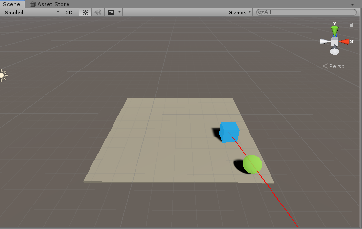
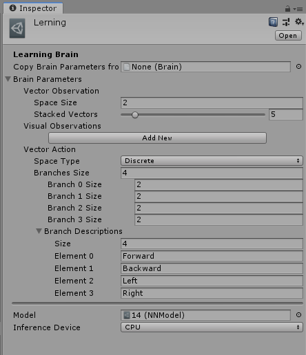
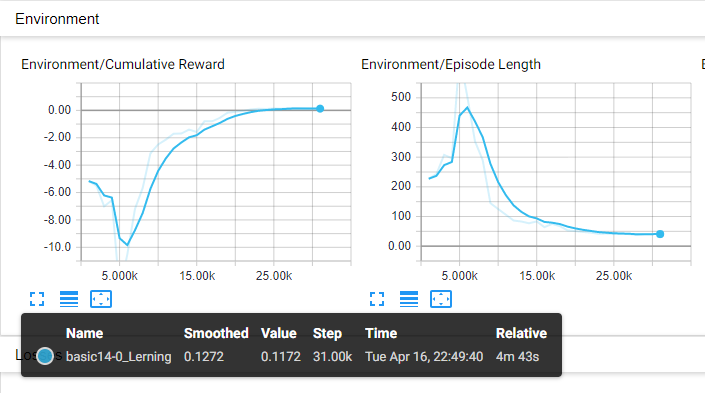
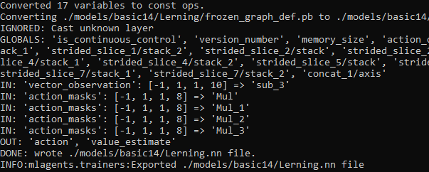
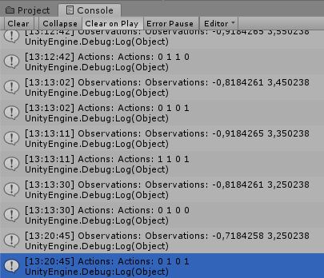

# Unity ml-agents example
## 1. 3D Environment

At first, I designed environment, it is refactored 'basic' from ml-agents.
On the screen we can see Agent - blue cube, and his target - green goal.
Here are main concepts of this environment:

- Agent and Goal are spawned randomly
- Agent is trying to achieve goal and get reward
- When agent collides goal - agents gets reward, and they are re-spawning

## 2. Let's design Brain

We need to design **input** and **output** of neural network. 
Unity's component **Brain** is responsible for such purposes, so, let's create it.

### 2.1 Input [Brain Observations]

Input = Observations. Only 2 parameters:

- relative X distance to goal
- relative Y distance to goal

Training works nice with normalized values, so input values must be in range [-1, 1]

### 2.2. Output [Brain Actions]

Output will represent keys four agent movements: [W, A, S, D]

- So, it will contain 4 branches. 
- Every branch has 2 possible discrete values: 0 and 1

### So, it will look like that:

| Output       | Movement | Description   |
| ------------ | -------- | ------------- |
| [1, 0, 0, 0] | W        | Move Forward  |
| [0, 1, 0, 0] | S        | Move Backward |
| [0, 0, 1, 0] | A        | Move Left     |
| [0, 0, 0, 1] | D        | Move Right    |

## 3. Learning

### Training the environment

Training took only 5 minutes. Pretty good

And as result I got trained model in .nn format. 
Brain can use this trained model and control agent. Let's check it

## Agent in action

As we see - it was automatically controlling Agent and achieving goal pretty fast.
I logged Agent 'observations' and 'actions' to verify that it is working as expected

### Outro

- If You have any questions - feel free to contact me on direct: danylo.stasenko@gmail.com
- Also feel free to make pull-request if You can improve something or faced any bugs

I think, that it can be good template for Your future projects or some kind of guide for beginners :) 

### Enjoy!